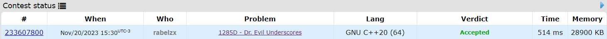
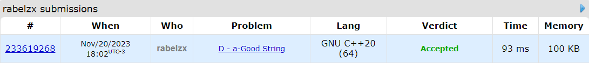

# Exercícios Online

**Conteúdo da Disciplina**: Dividir e Conquistar  

## Alunos
|Matrícula | Aluno |
| -- | -- |
| 21/1030729  |  Eric Rabelo Borges |
| 19/0058455  |  Mariana Oliveira Pires do Rio |

## Sobre 
Este projeto contém as resoluções de exercícios de Juiz Online que envolvem XXXXX. 

### Exercício 1:  [Golf Bot](http://uva.onlinejudge.org/index.php?option=com_onlinejudge&Itemid=8&category=24&page=show_problem&problem=4744)
O exercício aborda a perspectiva de alguém que, inicialmente, expressa aversão ao golfe e decide criar um robô de golfe infalível. Contudo, o robô enfrenta desafios durante o jogo devido à limitação do botão seletor de distância embutido, que não contempla todas as opções necessárias. Agora, no campo de golfe, a pessoa busca determinar quantos buracos o robô pode completar em duas tacadas ou menos, enfrentando o desafio de otimizar o desempenho do robô diante das restrições, especialmente a falta de opções adequadas de distância.

Confira o enunciado do exercício 

- [Ir para solução](Solutions/golf_bot.cpp)

### Exercício 2: 

Confira o enunciado do exercício [aqui]()

- [Ir para solução]()
### Exercício 3: [Dr. Evil Underscores](https://codeforces.com/problemset/problem/1285/D)

Confira o enunciado do exercício [aqui](https://codeforces.com/problemset/problem/1285/D)

- [Ir para solução](Solutions/Dr.EvilUnderscores.cpp)

### Exercício 4: [a-Good String](https://codeforces.com/contest/1385/problem/D)

Confira o enunciado do exercício [aqui](https://codeforces.com/contest/1385/problem/D)

- [Ir para solução](Solutions/a-GoodString.cpp)

## Screenshots

### Beautiful Paintings

### Impartial Gift

### Dr. Evil Underscores

### a-Good String

## Instalação 
Não é necessario instalação. As soluções podem ser submetidas nos sites: [AtCoder](https://atcoder.jp/) e [Codeforces](https://codeforces.com/).

**Linguagem**: C++ 

## Apresentação
Assista o vídeo explicativo do projeto clicando [aqui](/).  
*Observação: A apresentação está em formato .mp4, portanto, faça o download para assisti-la.*